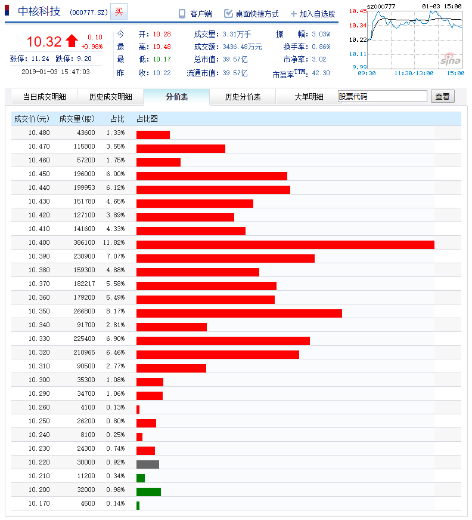
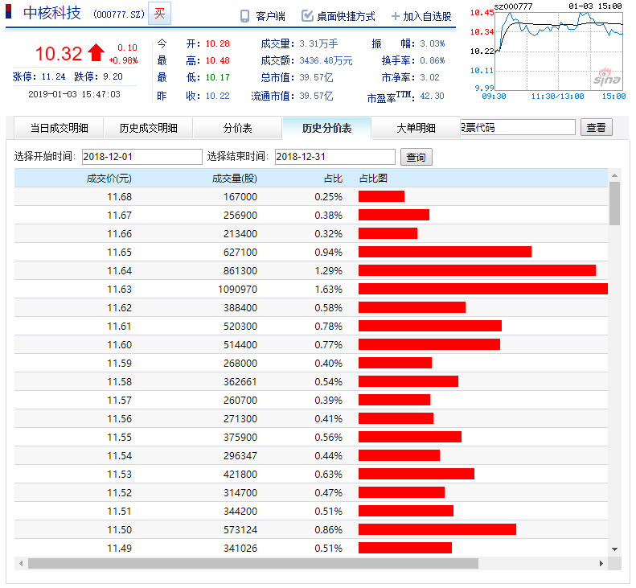

# 换手率

# 买点
* MACD
* KDJ

# 卖点
* MACD
* KDJ

# 盈亏

# [分价表](http://vip.stock.finance.sina.com.cn/quotes_service/view/cn_price.php?symbol=sz000777)


# [历史分价表](http://vip.stock.finance.sina.com.cn/quotes_service/view/cn_price_history.php?symbol=sz000777)

---

# [收益率](https://wiki.mbalib.com/zh-tw/%E6%94%B6%E7%9B%8A%E7%8E%87)

收益率（Earnings Rate/Earnings Yield/Rate of Return/Profitability）

## 计算公式

收益率 = 净利润 / 投资金额 * 100%

## [投资收益率](https://baike.baidu.com/item/%E6%8A%95%E8%B5%84%E6%94%B6%E7%9B%8A%E7%8E%87/2724753)

## 总投资收益率（ROI）

## 资本金净利润率（ROE）

# 日收益率
# 周收益率
# 月收益率
# 年收益率
# [年化收益率](https://baike.baidu.com/item/%E5%B9%B4%E5%8C%96%E6%94%B6%E7%9B%8A%E7%8E%87/6238244)

---

股票建模
股票数据挖掘

复利

1 元买入，10 元卖出，10 倍
1w => 10w
5W => 50W
10W => 100W

5 元买入，10 元卖出，1 倍
1W => 2W
5W => 10W
10W => 20W

现金流


7.85 => 8.1
7.65 => 7.9
7.45 => 7.7
7.25 => 7.5
7.05 => 7.3
6.85 => 7.1

# 价格

## 1. 价格分布：

### 1.1. OLAP

* 维度：customer_id, stock_code, price, deal_type, status, deal_date
* 度量：SUM(quantity|volume)

强制维度：customer_id, stock_code, price, deal_type

* WHERE
  - customer_id
  - stock_code
  - status: 未清算|已清算
  - deal_date

### 1.2. SQL

```
SELECT
    customer_id, stock_code, price, deal_type, SUM(quantity) AS volume
FROM deal
WHERE customer_id = 'customer_id' AND stock_code = '{stock_code}' AND deal_date >= '{start_time}' AND deal_date <= '{end_time}' AND status = '{status}'
GROUP BY customer_id, stock_code, price, deal_type
ORDER BY price;
```

---

# 历史成交

# 盈亏
- 收益率
  - 现金流：流动性
  - 单位时间收益率：3 天盈利 100 元和 30 天盈利 100 元
* 换手率趋势图


# 权限


# TODO

- 机器学习寻找奇点
- 模型验证

逻辑回归模型预测股票涨跌 => https://www.cnblogs.com/donaldlee2008/p/5595580.html

* [股票量化框架，支持行情获取以及交易](https://github.com/shidenggui/easyquant)


# 历史成交明细

* https://blog.csdn.net/weixin_42163573/article/details/81256348
